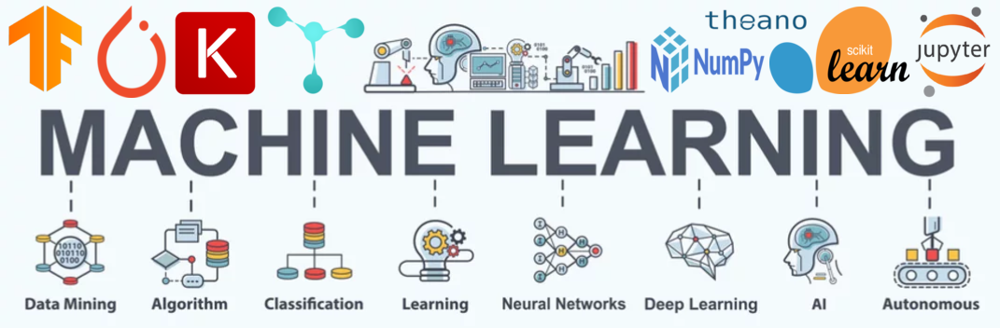

  

<h1 align="center">Hi 👋, I'm Shivam Maurya</h1>
<h3 align="center">Aspiring Data Science | Machine Learning | Deep Learning | Artificial Intelligence</h3>
                                                  
---

## 🚀 About Me
- 🎓 Data Science Student  
- 🔍 Interested in **Machine Learning, Data Analysis & AI**
- 📊 Love working on **real-world datasets**
- 🌱 Currently learning **Advanced ML,DL & SQL**
- 💼 Actively looking for **Internship / Entry-level Data Scientist roles**

---

## 🛠️ Skills & Tools

### 👨‍💻 Programming
- Python, SQL

### 📊 Data Science
- Data Cleaning, EDA, Feature Engineering
- Data Visualization (Matplotlib, Seaborn)

### 🤖 Machine Learning
- Regression, Classification
- Model Evaluation & Hyperparameter Tuning
- Scikit-learn

### 🧠 Deep Learning
- Artificial Neural Networks (ANN)
- Convolutional Neural Networks (CNN)
- Recurrent Neural Networks (RNN)
- TensorFlow, Keras

### 🧠 Artificial Intelligence
- Computer Vision
- Natural Language Processing (NLP)
- Predictive Modeling

### 🛠 Tools & Platforms
- Jupyter Notebook, Google Colab
- Git, GitHub
- Streamlit

---

## 📫 Connect With Me
- 💼 LinkedIn: *www.linkedin.com/in/shivam-maurya-2780a8288*
- 📧 Email: *shivammaurya1611@gmail.com*
<!--
**ishivamm/ishivamm** is a ✨ _special_ ✨ repository because its `README.md` (this file) appears on your GitHub profile.

Here are some ideas to get you started:

- 🔭 I’m currently working on ...
- 🌱 I’m currently learning ...
- 👯 I’m looking to collaborate on ...
- 🤔 I’m looking for help with ...
- 💬 Ask me about ...
- 📫 How to reach me: ...
- 😄 Pronouns: ...
- ⚡ Fun fact: ...
-->
